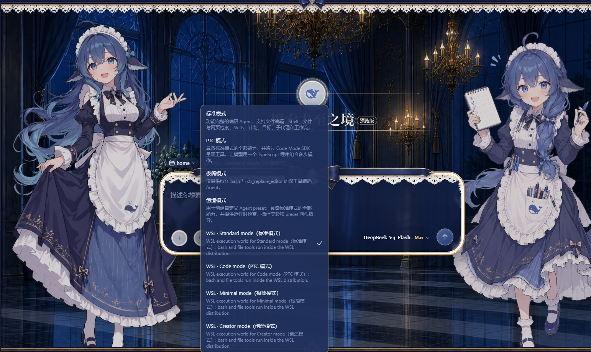
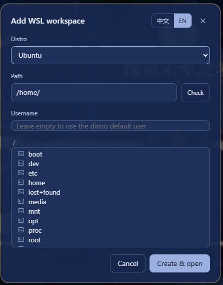

# dsh-wsl-workspace

[English](README.md) · [中文](README.zh.md) · [日本語](README.ja.md) · [한국어](README.ko.md) · [Français](README.fr.md) · [Deutsch](README.de.md) · [Español](README.es.md) · [Português](README.pt.md) · [Русский](README.ru.md)


Füge aus der DeepSeek-Harness-Web-GUI einen WSL-Arbeitsbereich hinzu und führe die gesamte Agent-Sitzung — Bash-Befehle und Datei-Lesen/-Schreiben — innerhalb einer lokalen WSL-Distribution mit Linux-Pfaden aus. In WSL muss nichts installiert werden. Die Sitzung kann gleichzeitig auf WSL und Windows zugreifen: Bash-Befehle laufen in der WSL-Distribution, während Windows-Dateien über `/mnt/<laufwerk>` (z. B. `/mnt/c/Users/...`) erreichbar bleiben.

## Installation

Wähle eine der drei folgenden Methoden und starte danach `dsh web` neu:

```powershell
# 1) npm-Paket
dsh plugin --profile web add dsh-wsl-workspace

# 2) GitHub-Repository (enthält das vorgebaute lib/, kein lokaler Build nötig)
dsh plugin --profile web add https://github.com/6Mikao9/dsh-wsl-workspace

# 3) Lokales Verzeichnis (Entwicklung / eigener Gebrauch)
dsh plugin --profile web add D:\path\to\dsh-wsl-workspace
```

Nach dem Neustart von `dsh web` erscheint neben Settings am unteren Rand der Seitenleiste ein W-Button.

## Nativer Build bei der Installation

Die Installation dieses Plugins zieht `@deepseek-ai/dsh-fs-local` (eine Peer-Dependency) nach, das von [`koffi`](https://www.npmjs.com/package/koffi) abhängt — einer dynamischen C-FFI für Node.js. koffi führt während `npm install` ein `install`-Skript aus (`node ./cnoke.cjs -P . -D src/koffi --prebuild --release`):

- **Prebuild zuerst**: es versucht, ein plattformspezifisches vorgebautes Addon aus koffis `optionalDependencies` (`@koromix/koffi-<plattform>`) zu laden; abgedeckt sind `win32-x64/arm64/ia32`, `linux-x64/arm64/ia32/riscv64/loong64`, `darwin-x64/arm64`, `freebsd-*`, `openbsd-*`. Lädt ein Prebuild, findet **keine Kompilierung statt**.
- **Fallback-Kompilierung**: nur wenn kein vorgebautes Addon verfügbar/ladbar ist, wird aus dem Quellcode neu gebaut; das erfordert CMake und einen C/C++-Compiler (Windows bevorzugt Clang, oder MinGW unter MSYSTEM). Das ist koffis eigenes Standardverhalten; dieses Plugin baut oder liefert selbst keinen nativen Code.

Das ist erwartet und nicht bösartig (koffi ist MIT-lizenziert). Eine Installation mit `--ignore-scripts` überspringt koffis Addon-Auswahl/-Build, sodass `@deepseek-ai/dsh-fs-local` auf Plattformen ohne zwischengespeichertes Prebuild möglicherweise nicht geladen werden kann. Die WSL-Sitzung selbst benötigt keine Toolchain: das Bash-Tool läuft in der WSL-Distribution und die Datei-Tools laufen über die Windows-seitige WSL-Freigabe.

## Verwendung

Klicke in der Seitenleiste unten neben Settings auf den W-Button, um den Dialog „Add WSL workspace" zu öffnen. Wähle eine Distribution, durchsuche den Verzeichnisbaum oder gib einen absoluten Linux-Pfad ein (z. B. `/home/me/proj`) — mit dem Check-Button kannst du prüfen, ob der Pfad existiert. Der Dialog folgt der Sprache der DeepSeek-Harness-Oberfläche. Das Feld Benutzername ist optional: Leer lassen führt die Befehle als Standardbenutzer der Distribution aus, ein Eintrag führt die Sitzung als diesen Benutzer aus (äquivalent zu `wsl.exe -u <benutzer>`). Der Benutzername ändert nur die Ausführungsidentität des Bash-Tools — die Datei-Tools laufen über die Windows-seitige WSL-Freigabe und sind davon unberührt. Der Benutzername jedes Arbeitsbereichs liegt in `<dshHome>/wsl-workspaces.json`; lösche den Eintrag (oder erstelle den Arbeitsbereich über den Dialog neu), um zum Standardbenutzer zurückzukehren.

Klicke auf „Create & open", um eine neue Sitzung im Arbeitsbereich zu starten. In der neuen Sitzung führt das Bash-Tool Befehle in der gewählten Distribution aus, und `read`/`write`/`edit` arbeiten auf WSL-Dateien — jeder vom Modell gesehene Pfad ist ein Linux-Pfad. Der Modus-Wähler funktioniert wie gewohnt: Standard, PTC, Minimal und Creative landen automatisch auf ihrer WSL-Variante (die WSL-Varianten-Einträge im Wähler sind zweisprachig, z. B. `WSL · Standard mode（标准模式）`), und Windows-Dateien bleiben aus der Sitzung unter `/mnt/<laufwerk>` (z. B. `/mnt/c/Users/...`) erreichbar.


## Verhaltenshinweise

- **Bash-Tool**: läuft in der WSL-Distribution als der konfigurierte Benutzername (leer = Standardbenutzer der Distribution, oft `root`) und kann daher überall in der Distribution lesen und schreiben. Die Windows-ACL-Sandbox kann `wsl.exe` nicht umhüllen — die Kindprozesse laufen auf der Linux-Kernelseite — daher ist WSL selbst die Isolationsgrenze, und die DSH-Dateipolitik gilt nicht für Bash.
- **Datei-Tools (`read`/`write`/`edit`)**: laufen über die Windows-seitige WSL-9P-Freigabe und unterliegen der DSH-Dateipolitik. Unter `workspace-write` ist Lesen überall möglich, Schreiben aber auf den Sitzungs-Arbeitsbereich beschränkt; stelle die Politik auf `danger-full-access` um, um auch außerhalb schreiben zu können. Das Benutzername-Feld betrifft die Datei-Tools nicht.
- Das verzerrte `localhost`-Port-Forwarding-Banner, das `wsl.exe` auf stderr ausgibt, wenn die Distribution noch nicht lief, ist harmlos.

## Änderungsprotokoll

### 0.2.4

- **#5 behoben — der WSL-Minimalmodus unterbricht die „we need/lets"-Gedankenkette der ersten Anfrage nicht mehr.** Bisher injizierte die WSL-Variante eines minimalen Presets (das nur `persistent-bash` + `str-replace-editor` bereitstellt) zusätzlich das einmalige `bash`-Werkzeug sowie die Datei-Werkzeuge `read`/`write`/`edit`/`read_image`; der doppelte `bash`-Werkzeugname und die zusätzlichen Schemas blähten den Werkzeugkatalog der ersten Anfrage auf und brachten die Gedankenkette aus dem Takt. Minimale Varianten behalten jetzt nur `persistent-bash`, `str-replace-editor` und den `fs-wsl`-Provider; Standard-Presets erhalten weiterhin die vollständige Shell- + Datei-Werkzeugwelt.

## Lizenz und Namensnennung

MIT — siehe [LICENSE](LICENSE) und [NOTICE](NOTICE). Das NOTICE listet präzise auf:

- **Angepasster/übernommener Quellcode**: DeepSeek Harness (MIT) — `dsh-bash-local` (Ausführungsmechanik), `dsh-fs-local` (`WslFileSystem` subklassifiziert es) und die mitgelieferten Agent-Presets (vom Variantengenerator gelesen und transformiert);
- **Design-Referenzen (kein Code kopiert)**: [dsh-bash-terminal](https://github.com/MAXeaglet/dsh-bash-terminal) (MIT, wsl-argv-/WSLENV-Ansatz), [dsh-side-panel](https://github.com/ccq1/dsh-side-panel) (BSD-3-Clause, Host-Route-Muster), [vpshub](https://github.com/Sdongmaker/vpshub) (MIT, Roadmap-Referenz).

Behalte `LICENSE` und `NOTICE` bei der Weiterverteilung bei.

## Danksagung

Besonderer Dank an [dsh-deep-whale](https://github.com/Small-tailqwq/dsh-deep-whale) (DSH-Web-鲸鱼娘-Skin-Serie · 深海女仆工坊 maid-atelier, CC BY-NC-SA 4.0): Das Wal-Mädchen-Skin-Plugin bringt eine ganze Reihe bezaubernder Skins in die DeepSeek-Harness-Web-Oberfläche und macht die tägliche Nutzung von DSH wärmer.
